<!-- Every image here is built by scripts/build.mjs. Edit the scripts, not the SVGs. -->

<a href="https://dylansiusputra.vercel.app"><picture><source media="(prefers-color-scheme: dark)" srcset="assets/header-dark.svg"></picture></a>

<a href="https://dylansiusputra.vercel.app"><picture><source media="(prefers-color-scheme: dark)" srcset="assets/badge-portfolio-dark.svg">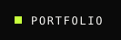</picture></a>
<a href="https://crescens.dev"><picture><source media="(prefers-color-scheme: dark)" srcset="assets/badge-crescens-dark.svg">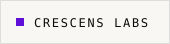</picture></a>
<a href="https://linkedin.com/in/dylansius-putra-prasetio"><picture><source media="(prefers-color-scheme: dark)" srcset="assets/badge-linkedin-dark.svg">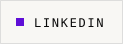</picture></a>
<a href="https://x.com/LannImpactID"><picture><source media="(prefers-color-scheme: dark)" srcset="assets/badge-x-dark.svg">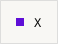</picture></a>
<a href="mailto:dylansius.putra@gmail.com"><picture><source media="(prefers-color-scheme: dark)" srcset="assets/badge-email-dark.svg">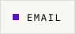</picture></a>
<a href="https://dylansiusputra.vercel.app/CV_Dylansius_Putra.pdf"><picture><source media="(prefers-color-scheme: dark)" srcset="assets/badge-cv-dark.svg">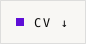</picture></a>

<picture><source media="(prefers-color-scheme: dark)" srcset="assets/ticker-dark.svg"></picture>

<picture><source media="(prefers-color-scheme: dark)" srcset="assets/work-head-dark.svg"></picture>

<a href="https://dylansiusputra.vercel.app"><picture><source media="(prefers-color-scheme: dark)" srcset="assets/card-mandate-dark.svg"></picture></a>
<a href="https://github.com/Dylansius11/AgentDesk"><picture><source media="(prefers-color-scheme: dark)" srcset="assets/card-agentdesk-dark.svg"></picture></a>

<a href="https://royalecard-arena.vercel.app"><picture><source media="(prefers-color-scheme: dark)" srcset="assets/card-royalecard-dark.svg"></picture></a>
<a href="https://annona-protocol.vercel.app"><picture><source media="(prefers-color-scheme: dark)" srcset="assets/card-annona-dark.svg"></picture></a>

<a href="https://simplybox.id"><picture><source media="(prefers-color-scheme: dark)" srcset="assets/card-simplybox-dark.svg"></picture></a>
<a href="https://lokal-fnb.vercel.app"><picture><source media="(prefers-color-scheme: dark)" srcset="assets/card-lokal-dark.svg"></picture></a>

<a href="https://dylansiusputra.vercel.app"><picture><source media="(prefers-color-scheme: dark)" srcset="assets/recognition-dark.svg"></picture></a>

<a href="https://crescens.dev"><picture><source media="(prefers-color-scheme: dark)" srcset="assets/clients-dark.svg"></picture></a>

<a href="https://crescens.dev/work/pawtrait">Pawtrait case study</a> · <a href="https://crescens.dev/work/snapose">Snapose case study</a>

<a href="https://dylansiusputra.vercel.app"><picture><source media="(prefers-color-scheme: dark)" srcset="assets/footer-dark.svg"></picture></a>
